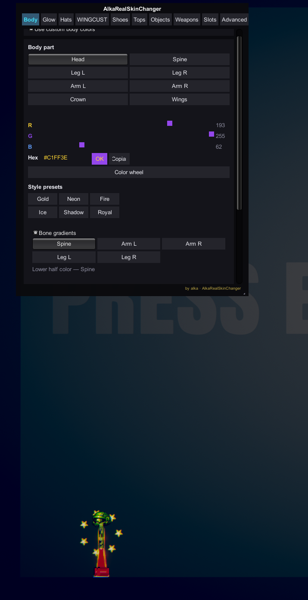
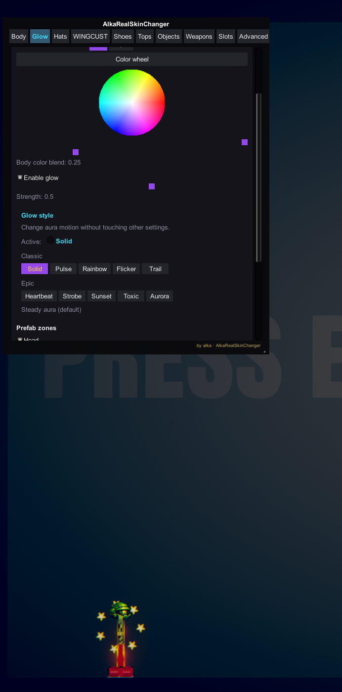
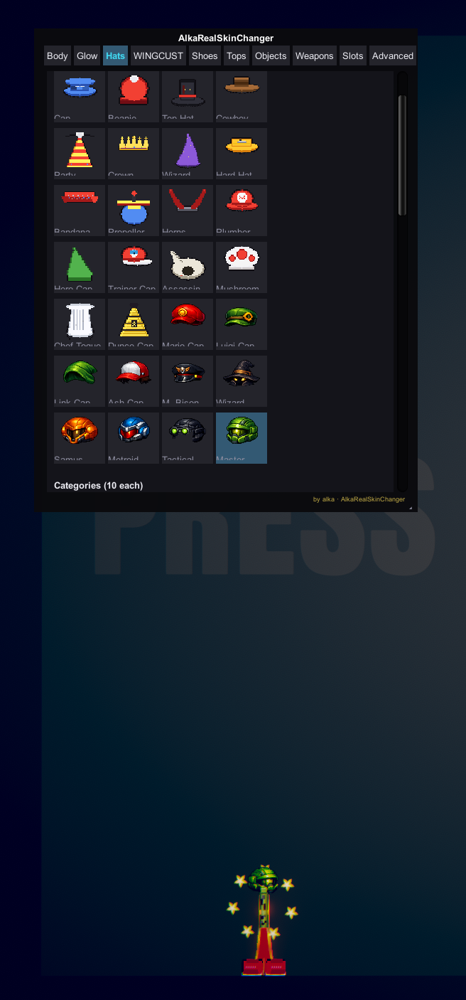
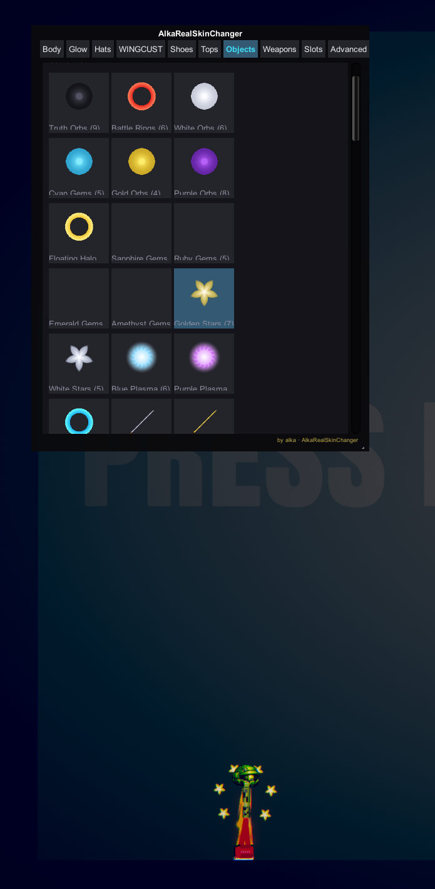
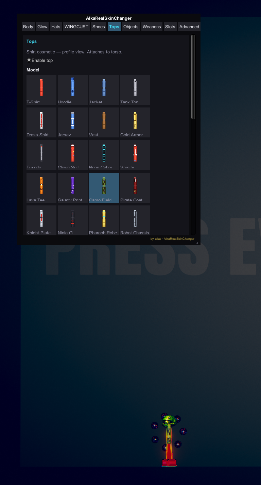
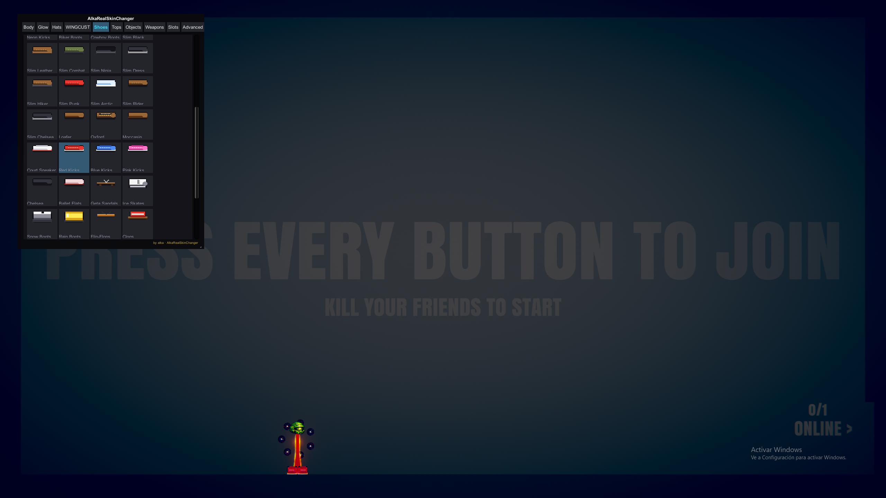

# AlkaRealSkinChanger

**Alka Real Skin Changer** — an **unofficial** cosmetic mod for [**Stick Fight: The Game**](https://store.steampowered.com/app/674940/Stick_Fight_The_Game/) (Unity 5.6, x86).

Press **F6** in-game for the **AlkaSkin** menu: body colors, glow, hats, tops, shoes, floating orbit objects, wings, weapons, style slots, and optional color sync between players who also run this mod.

| | |
|---|---|
| **Author** | **alka** ([AlkaPrime12](https://github.com/AlkaPrime12)) |
| **Version** | 2.3.0 |
| **Discord** | `tyralka0660` |
| **Loaders** | MelonLoader **0.5.7** (x86) **or** BepInEx **5.4.x** (x86) — **not both** |

---

## Disclaimer

This project is **not affiliated with, endorsed by, or sponsored by** [Landfall West](https://landfall.se/) / Landfall Games.

**Stick Fight: The Game**, its assets, names, and trademarks belong to their respective owners. You must **own a legitimate copy** of the game. This mod is provided **as-is** for personal use with Stick Fight only.

---

## Features (overview)

| Category | Count (approx.) | Notes |
|----------|-----------------|--------|
| **Hats** | ~198 IDs | 28 in main list + 170 category variants + 10 optional HD PNG hats (`AlkaSkin_Images/`) |
| **Tops** | 12 | Shirts, hoodies, armor, tuxedo, etc. |
| **Shoes** | 27 | Sneakers, boots, slim line, etc. |
| **Floating objects** | 57 sets | Orbs, weapons orbit, symbols, meme icons, etc. |
| **Glow styles** | 10 | Solid + classic + epic animated auras |
| **Wings** | 1 style | Cosmetic clone of minigame wings (WinCust tab) |
| **Body presets** | 6 | Fire, Ice, RGB, Shadow, Neon, Royal |
| **Weapon tints** | 6 | Local weapon recolor |
| **Style slots** | up to 24 | Save/load full looks |

**Multiplayer:** optional sync between players with the same mod (Steam lobby metadata + vanilla ping piggyback). **Vanilla-safe MP** mode is on by default (recommended).

---

## Showcase

Body editor  


Glow styles  


Hats catalog  


Objects catalog  


Tops catalog  


Full lobby preview  


---

## Search Tags (ES/EN/RU/ZH)

`stick fight mod`, `stickfight skin changer`, `melonloader 0.5.7`, `bepinex 5`, `multiplayer cosmetic mod`, `alka skin changer`, `mod de skins stick fight`, `personalizador stick fight`, `скин мод stick fight`, `мод кастомизации stick fight`, `火柴人格斗 模组`, `皮肤自定义 模组`

---

## Installation (players)

### Download Here (direct DLL — no ZIP)

**MelonLoader version**

- [**Download `AlkaRealSkinChanger.dll`**](release/MelonLoader/AlkaRealSkinChanger.dll) ← right-click → Save As
- Optional HD hats folder: [`release/MelonLoader/AlkaSkin_Images/`](release/MelonLoader/AlkaSkin_Images/)

**BepInEx version**

- [**Download `AlkaSkin.dll`**](release/BepInEx/AlkaSkin.dll) ← right-click → Save As
- Optional HD hats folder: [`release/BepInEx/AlkaSkin_Images/`](release/BepInEx/AlkaSkin_Images/)

Pick **only one** loader. Do **not** use ZIP (wrong folder = `0 Mods loaded`).

### MelonLoader (recommended)

1. Install [**MelonLoader 0.5.7**](https://melonwiki.xyz/) on Stick Fight (**x86 / 32-bit** — do **not** use 0.6+ on Unity 5.6).
2. Close the game.
3. Download **`AlkaRealSkinChanger.dll`** from the link above.
4. Paste it **directly** into:
   - `StickFightTheGame/Mods/AlkaRealSkinChanger.dll`
5. Optional: copy folder `AlkaSkin_Images` into the same `Mods/` folder.
6. Launch the game → console should show **`1 Mods loaded`**.
7. Press **F6** in lobby or match.

**Common mistake:** nested paths like `Mods/Mods/...` or extracting a ZIP into the wrong place → **`0 Mods loaded`**.

### BepInEx

1. Install **BepInEx 5.4.x** (x86). See [`StickFightColorCustomizer/README-BEPINEX.md`](StickFightColorCustomizer/README-BEPINEX.md).
2. Close the game.
3. Download **`AlkaSkin.dll`** from the link above.
4. Paste into:
   - `StickFightTheGame/BepInEx/plugins/AlkaSkin/AlkaSkin.dll`
5. Optional: copy `AlkaSkin_Images` into `BepInEx/plugins/AlkaSkin/`.
6. Press **F6** in game.

Do **not** run MelonLoader and BepInEx on the same install.

### HD hat images (optional)

Place PNG files in `Mods/AlkaSkin_Images/` (filenames documented in `HatImageLoader.cs`). The mod works without them; only HD reference hats are missing.

**Do not redistribute copyrighted character art** you did not create or license. Supply your own PNGs or omit the folder.

---

## Building from source

Requirements: Visual Studio / MSBuild, **.NET Framework 3.5**, Stick Fight installed.

1. Copy reference DLLs from your game into `StickFightColorCustomizer/Deps/` — see [`StickFightColorCustomizer/Deps/README.md`](StickFightColorCustomizer/Deps/README.md).
2. Build:

```powershell
.\build-all.ps1
```

Output:

| Loader | Output path |
|--------|-------------|
| MelonLoader | `Mods/AlkaRealSkinChanger.dll` |
| BepInEx | `BepInEx/plugins/AlkaSkin/AlkaSkin.dll` |

More detail: [`StickFightColorCustomizer/BUILD.md`](StickFightColorCustomizer/BUILD.md).

---

## Repository layout

```
AlkaRealSkinChanger/
├── README.md                 ← you are here
├── LICENSE                   ← usage & redistribution terms
├── build-all.ps1
├── StickFightColorCustomizer/    MelonLoader mod (main)
├── StickFightColorCustomizer.BepInEx/
├── docs/                     developer notes
└── StickFightColorCustomizer.sln
```

---

## Credits & attribution

| | |
|---|---|
| **Mod** | **alka** — design, code, AlkaSkin UI |
| **Game** | **Stick Fight: The Game** © Landfall West / Landfall Games |
| **Harmony** | [Harmony](https://github.com/pardeike/Harmony) (patching) |
| **MelonLoader / BepInEx** | respective authors |

If you fork, port, or reuse this source: see **[LICENSE](LICENSE)** — credit **alka** and link to this repo, **or** contact **`tyralka0660`** on Discord before publishing derivatives.

---

## Support

- **Issues:** [GitHub Issues](https://github.com/AlkaPrime12/AlkaRealSkinChanger/issues)
- **Discord:** `tyralka0660` (author)

Official game support: Landfall / Steam — not this mod.

---

## Legal & redistribution

- **Free, official distribution** of compiled releases and source is only from **alka** via this GitHub repo (and links the author posts).
- **Selling** this mod, paywalling downloads, or redistributing builds **without permission** may be treated as **unauthorized use of private developer content** and pursued accordingly.
- You may study and reuse **source code** under the terms in **[LICENSE](LICENSE)** (attribution / Discord notice required).

**English summary:** use and share the code with credit; do not sell or repackage for profit without permission.
