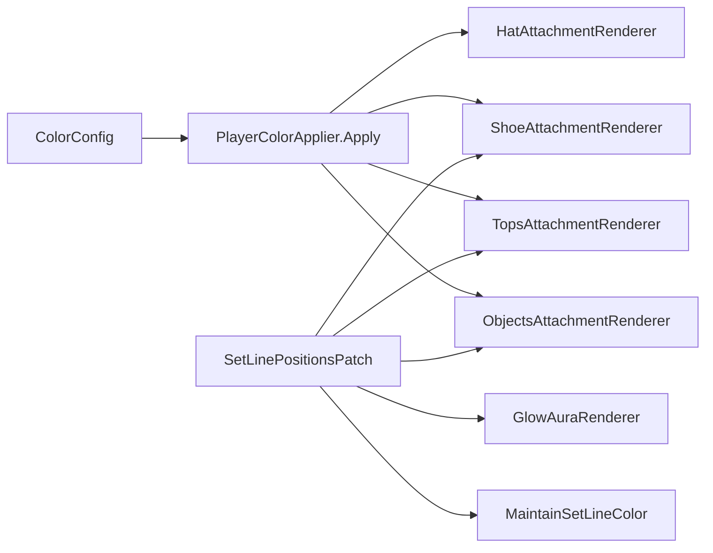

# Stick Fight Color Customizer — Referencia de cosméticos

Documentación para continuar desarrollo (otra IA o mantenimiento). Proyecto: `StickFightColorCustomizer` / DLL `AlkaRealSkinChanger.dll`.

## Despliegue

- **Build:** `build-all.ps1` (raíz del repo)
- **MelonLoader:** `StickFightTheGame/Mods/AlkaRealSkinChanger.dll`
- **BepInEx:** `StickFightTheGame/BepInEx/plugins/AlkaSkin/AlkaSkin.dll`
- Usar **solo un** loader (ver `INSTALL-LOADERS.md`)

---

## Anatomía del stickman (Unity)

```
Controller
└── Renderers
    ├── headRenderer      → LineRenderer cabeza
    ├── spineRenderer     → Hip, Torso (LineRenderer)
    ├── legRenderer       → LeftKnee, LeftLeg / Leg_Left
    ├── legRenderer2      → RightKnee, RightLeg / Leg_Right
    ├── handRenderer      → brazo izquierdo
    └── handRenderer2     → brazo derecho
```

| Nodo | Hijos típicos | `StickColorPart` |
|------|---------------|------------------|
| `headRenderer` | línea cabeza | Head |
| `spineRenderer` | `Hip`, `Torso` | Spine |
| `legRenderer` | `LeftKnee`, `LeftLeg` | LegLeft |
| `legRenderer2` | `RightKnee`, `RightLeg` | LegRight |

**Reglas de anclaje**

- **Pivot único:** `SFCC_CosmeticPivot` bajo `Renderers` (posición = pecho mundo, rotación identidad, escala 1).
- Zapatos / pie: hueso **distal** (`LeftLeg`, `RightLeg`) con holder neutral; fallback anchor en `Controller`.
- **Nunca** parentear orbes al `spine.transform` del LineRenderer ni mezclar `position` mundo con jerarquía local sin pivot.
- **Nunca** parentear sprites al hueso del pie sin holder (escala Y enorme → invisible o estirado).

**Utilidades**

- `CosmeticFollowPivot.EnsurePivot(controller)` / `TryGetChestWorld` / `GetOrbitOffsetWorld`
- `PlayerColorApplier.FindRenderersRoot(controller.transform)` → `Renderers`
- `CosmeticLineAttachUtil.TryResolveFootLine(legNode, isRight, out footLine)`
- `CosmeticLineAttachUtil.GetFootWorldPosition(footLine)`

---

## Pipeline por feature



### Sombrero (`HatAttachmentRenderer`)

- Parent: hueso de `headRenderer` (escala moderada).
- Local position en cabeza; escala por `HeadRadius`.
- Sync: al aplicar + cuando cambia config.

### Zapatos (`ShoeAttachmentRenderer`) — enfoque actual (render + holder)

1. Resolver pie: `LeftLeg`/`RightLeg` → `GetFootLocalOnLine(footLine, 0.97)`.
2. **Holder** `SFCC_Shoe_Holder_L/R` hijo del hueso del pie con `localScale` inverso a `lossyScale` (evita estirar/invisibilizar).
3. Zapato hijo del holder, `localPosition = 0`, escala **0.25–0.50** según grosor del pie.
4. **Fallback:** `SFCC_Shoes_Anchor` en Controller + `GetFootWorldPosition` cada frame si holder inválido.
5. `sortingOrder = footLine.sortingOrder + 12`.
6. Sync en `SetLinePositionsPatch` para piernas y rodillas; tick lobby **0.1s** (`ShoeTickInterval`).

Ver también: `docs/COSMETICS-TROUBLESHOOTING.md`.

### Tops (`TopsAttachmentRenderer`)

- Dos líneas espejo en `spineRenderer`: `SFCC_Tops_Solid` (underlay fino 1.02×) + `SFCC_Tops_Line` (textura).
- Ancho: `(spine.widthMultiplier * 1.18) / spriteThin`, clamp 1.15–1.75.
- `sortingOrder` +120 sobre espina; líneas `SFCC_*` **excluidas** de `MaintainSetLineColor`.
- Sync tops **después** del color del cuerpo en `SetLinePositionsPatch`.
- Sprites: `TopsSpriteFactory`, `ArtGeneration` **14**; `tileX` min **0.65** en espejo.

### Objetos (`ObjectsAttachmentRenderer`)

- Root `SFCC_Objects` parent en **`SFCC_CosmeticPivot`** (`CosmeticFollowPivot`).
- Centro: pecho desde vértices de espina; `root.localPosition = 0`.
- Órbita: `cos/sin` con ejes cámara; offset aplicado como `localPosition` vía `InverseTransformPoint`.
- Detrás: `sortingOrder = spine - 10`, Z `spine.z + 0.03`.
- Tick: `TickObjects` 0.05s; patch sync **solo** en `spineRenderer`.

### Glow (`GlowAuraRenderer`)

- Líneas espejo por hueso; independiente de zapatos/tops.

---

## Convenciones de sorting (2D)

| Cosmético | sortingOrder típico |
|-----------|---------------------|
| Cuerpo (spine) | base del juego |
| Objetos detrás | `spine - 10` |
| Zapatos | `footLine + 12` |
| Tops solid | `spine + 115` |
| Tops textura | `spine + 120` |
| Sombrero | `headLine + 28` |
| Glow | según config |

Profundidad Z: ajustar `transform.position.z` respecto a espina (objetos detrás: `spine.z + 0.03`).

---

## Archivos clave

| Área | Archivos |
|------|----------|
| Zapatos | `Core/ShoeAttachmentRenderer.cs`, `Core/ShoeSpriteFactory.cs`, `Core/ShoeCatalog.cs` |
| Objetos | `Core/ObjectsAttachmentRenderer.cs`, `Core/ObjectsCatalog.cs`, `Core/ObjectSpriteFactory.cs` |
| Tops | `Core/TopsAttachmentRenderer.cs`, `Core/TopsSpriteFactory.cs`, `Core/CosmeticBoneLineMirror.cs` |
| Anclaje | `Core/CosmeticFollowPivot.cs`, `Core/CosmeticLineAttachUtil.cs`, `Core/StickLineUtil.cs` |
| Troubleshooting | `docs/COSMETICS-TROUBLESHOOTING.md` |
| Sync frame | `Patches/SetLinePositionsPatch.cs`, `Hosting/ColorCustomizerApp.cs` |
| Color cuerpo | `Core/PlayerColorApplier.cs` |
| MP | `Network/SteamLobbyColorSync.cs`, codecs de hat/shoe/object |

---

## Checklist de prueba (lobby)

1. Cerrar juego → `build-all.ps1` → abrir lobby.
2. **Zapatos:** visibles en ambos pies; idle, caminar, saltar; no en torso; no estirados.
3. **Objetos (`orbs_truth_9`):** anillo alrededor del pecho; **detrás** del stickman; sigue al moverse.
4. **Tops:** sprite rojo/textura visible, ancho similar al torso; cuerpo no se ve a través.
5. **MP:** otro jugador ve hat/shoes/objects remotos (sync existente).

---

## Debug rápido

- `PlayerColorApplier.LogRendererPaths(controller)` — rutas de huesos.
- `CosmeticAttachDiagnostics` — logs de attach (si habilitado).
- Verificar que líneas mod no se recoloreen: nombre `SFCC_*`, tag `DontChangeColor`.
- Si zapatos invisibles: revisar `lossyScale` del parent (debe ser anchor 1,1,1).
- Si objetos despegados: revisar `SFCC_CosmeticPivot` bajo `Renderers` y logs `[SFCC-Objects]`.

---

## Próximas mejoras sugeridas

- Sombra bajo zapato (segundo sprite).
- Layout `OrbitBackArc` solo media luna tras el jugador.
- Objetos delante opcional (`BehindBody = false`) para efectos “delante de manos”.
- Tests automáticos de `ResolveFootWorld` con mocks de vértices.
- Reducir tick de shoes/objects en lobby si hace falta rendimiento.

---

## Versión de esta referencia

Generada tras mega fix: `SFCC_CosmeticPivot`, orbes local orbit, zapatos holder+anchor, tops ArtGeneration 14.
